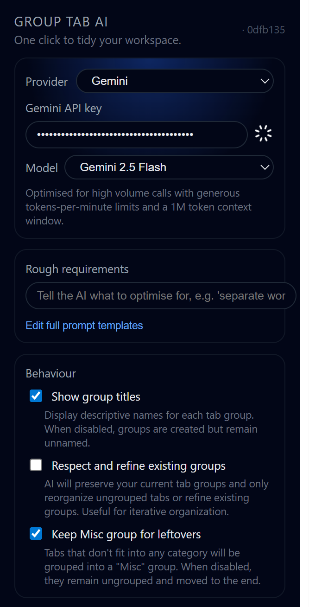

# Group Tab AI Extension


An intelligent browser extension that uses advanced AI (OpenAI/Gemini) to automatically organize your browser tabs into logical, context-aware groups. Goes beyond simple domain-based grouping by analyzing actual page content, understanding your workflow, and learning from your preferences.



## Key Features

### Intelligent Content Analysis
- **Deep Context Understanding**: Analyzes page titles, descriptions, headings, and body content
- **Smart Grouping**: Groups by task/activity, not just domains
- **Multi-Domain Intelligence**: Handles 30+ tabs from same domain by splitting into topic-specific groups
- **Universal Applicability**: Works for all professions (developers, designers, marketers, researchers, students, etc.)

### Advanced AI Capabilities
- **Dual AI Provider Support**: Choose between OpenAI (GPT-4, GPT-3.5) or Google Gemini
- **Optimized Performance**: Gemini configured with `thinkingBudget: 0` for faster responses
- **Context-Rich Prompts**: Sends up to 800 characters of page context per tab
- **Customizable Prompts**: Edit AI prompts directly in the extension

### Learning System (NEW!)
- **Behavior Tracking**: Records your manual tab grouping actions
- **Pattern Recognition**: AI analyzes your preferences and workflow patterns
- **Insight Generation**: Discovers your grouping preferences automatically
- **Prompt Auto-Improvement**: AI suggests prompt revisions based on your behavior
- **Accept/Reject System**: Review and approve AI-generated insights

### Modern UI/UX
- **Clean Interface**: Beautiful dark-themed popup with gradient accents
- **Real-time Feedback**: Progress indicators, status messages, and toast notifications
- **Multi-Tab Interface**: Separate tabs for Settings, Prompts, and Learning
- **Visual Status**: Badge shows elapsed time during grouping operations

### Flexible Configuration
- **Keep Existing Groups**: Option to preserve and refine current groups
- **Special Requirements**: Add custom instructions for grouping behavior
- **Show Group Names**: Toggle AI-generated names in tab groups
- **Keyboard Shortcuts**: `Alt+Q` to group, `Alt+A` to ungroup all tabs

## Installation

### From Release (Recommended)
1. Download the [latest release](https://github.com/quochung-cyou/group-tab-ai-extension/releases/latest)
2. Unzip the downloaded file
3. Open Chrome/Edge and navigate to `chrome://extensions/`
4. Enable "Developer mode" (toggle in top right)
5. Click "Load unpacked" and select the unzipped folder

### Setup
1. Click the extension icon to open the popup
2. Go to **Settings** tab
3. Choose your AI provider (OpenAI or Gemini)
4. Enter your API key:
   - **OpenAI**: Get from [platform.openai.com/api-keys](https://platform.openai.com/api-keys)
   - **Gemini**: Get from [aistudio.google.com/api-keys](https://aistudio.google.com/api-keys)
5. Select your preferred model
6. Configure optional settings (keep existing groups, special requirements, etc.)

## Development

### Prerequisites
- Node.js (v16+)
- PNPM package manager

### Setup
```bash
git clone https://github.com/quochung-cyou/group-tab-ai-extension.git
cd group-tab-ai-extension
pnpm install
```

### Development Commands
```bash
# Start development server (Chrome)
pnpm dev

# Start development server (Edge)
pnpm dev:edge

# Build for production (Chrome)
pnpm build

# Build for production (Edge)
pnpm build:edge

# Run linter
pnpm lint
```

### Load Development Build
1. Run `pnpm dev`
2. Open Chrome and go to `chrome://extensions/`
3. Enable "Developer mode"
4. Click "Load unpacked"
5. Select `build/chrome-mv3-dev` folder

The extension will auto-reload when you make changes.

### Creating a Release

This project uses GitHub Actions to automatically build and publish releases.

#### Method 1: Manual Workflow Trigger
1. Go to [Actions tab](https://github.com/quochung-cyou/group-tab-ai-extension/actions)
2. Select "Build and Release" workflow
3. Click "Run workflow"
4. Enter the version number (e.g., `1.4.3`)
5. Click "Run workflow" button

#### Method 2: Git Tag (Automatic)
```bash
# Create and push a version tag
git tag v1.4.3
git push origin v1.4.3
```

The workflow will:
- Build the extension for Chrome
- Create a ZIP file named `group-tab-ai-extension-v{version}-{date}-{sha}.zip`
- Generate changelog from commits
- Create a GitHub release with the ZIP attached
- Upload build artifacts for debugging

#### Release Naming Convention
Releases follow the pattern: `v{version}-{YYYYMMDD}-{short-sha}`
- Example: `v1.4.2-20251114-a1b2c3d`
- Ensures unique, sortable, and traceable releases

## How It Works

### Grouping Process
1. **Content Extraction**: Extension injects scripts to extract page content (titles, headings, descriptions, body text)
2. **Context Building**: Assembles rich context for each tab (up to 800 chars per tab)
3. **AI Analysis**: Sends tab data to AI with intelligent prompts
4. **Smart Grouping**: AI analyzes content, detects activities, extracts entities, and groups by task/topic
5. **Application**: Extension applies grouping with color-coded tab groups

### Content Analysis
The extension extracts:
- Page title and meta description
- H1 and H2 headings
- Open Graph metadata (og:type, og:description)
- Meta keywords
- Main content body text (filtered, cleaned)
- URL structure (host, path)

### AI Prompt System
Two specialized prompts handle different scenarios:

**`organize-all-tabs.txt`** - Fresh grouping from scratch
- Deep content analysis with entity extraction
- Activity and workflow detection
- Smart domain splitting (30+ tabs → topic-specific groups)
- Anti-lazy grouping enforcement (no generic names)
- Quality validation checks

**`update-groups.txt`** - Refine existing groups
- Preserves user intent and good groupings
- Integrates ungrouped tabs intelligently
- Refines generic group names
- Balances group sizes
- Respects organizational patterns

## Prompt Engineering

### Design Philosophy
1. **Task-Oriented**: Group by what user is DOING, not domain names
2. **Content-First**: Analyze actual page content, not just titles
3. **Universal**: Works for all professions (tech, design, marketing, healthcare, education, etc.)
4. **Concise Naming**: Target 2 words, max 3 words for group names
5. **Smart Splitting**: 30 YouTube tabs → "Python Tutorials", "Music", "Tech Reviews"

### Naming Guidelines
- ✅ **Good**: "Brand Guidelines", "Campaign Analytics", "Patient Records"
- ❌ **Bad**: "Work", "Research", "Browser", "Tabs", "Misc"

### Forbidden Terms
Generic/lazy names that indicate poor grouping:
- Browser, Tabs, Links, Pages, Sites, Web, Internet
- Misc, Other, Various, Mixed, General, Stuff
- Too broad: Work, Personal, Development, Research

### Word Reduction Techniques
1. Drop redundant nouns: "Resources", "Tools", "Articles"
2. Use slashes: "Budget/Finance" not "Budget and Finance"
3. Abbreviate when standard: ML, AI, CRM, ROI, API
4. Trust context: Tabs reveal details

## Learning System

### Overview
The Learning System tracks your manual tab grouping actions and uses AI to discover your preferences and improve prompts automatically.

### Features

**Event Tracking**
- Records all manual tab moves, renames, and ungrouping
- Tracks which tabs you group together
- Monitors deviations from AI suggestions
- Stores up to 500 events (90 days)

**Insight Generation**
- AI analyzes your behavior patterns
- Discovers domain preferences (e.g., "Always group GitHub repos separately")
- Identifies topic preferences (e.g., "Prefer specific project names over generic 'Work'")
- Detects workflow patterns (e.g., "Group research tabs by sub-topic")
- Finds anti-patterns (e.g., "Never group social media with work tabs")

**Prompt Revision**
- AI suggests prompt improvements based on insights
- Shows specific changes and reasoning
- Accept/reject system for user control
- Automatically applies accepted revisions

### Usage
1. Enable Learning System in Settings tab
2. Use the extension normally - manual grouping is tracked
3. After 10+ events, go to Learning tab
4. Click "Analyze Behavior" to generate insights
5. Review and accept/reject insights
6. Click "Generate Prompt Revision" for AI-improved prompts
7. Review and accept to apply improvements

### Configuration
- **Auto-analyze**: Notify when ready (disabled by default)
- **Analysis Frequency**: Every N actions or N days
- **History Retention**: Max events and days to keep
- **Confidence Threshold**: Minimum confidence for insights

## Architecture

### File Structure
```
group-tab-ai-extension/
├── background/
│   ├── command/
│   │   ├── groupAllTabs.ts      # Main grouping logic
│   │   ├── autoGroup.ts          # Auto-grouping
│   │   └── unGroupAllTabs.ts     # Ungroup all
│   ├── messages/                 # Message handlers
│   │   ├── groupAllTabs.ts
│   │   └── learning/             # Learning system handlers
│   ├── providers/
│   │   ├── openai.ts             # OpenAI provider
│   │   ├── gemini.ts             # Gemini provider
│   │   └── index.ts              # Provider factory
│   ├── prompts/
│   │   ├── insightAnalysis.txt   # Learning insights prompt
│   │   └── promptRevision.txt    # Prompt improvement prompt
│   ├── learningAnalyzer.ts       # Learning system AI logic
│   ├── tabContent.ts             # Content extraction
│   ├── tabGroupListener.ts       # Event tracking
│   ├── toast.ts                  # Notifications
│   └── index.ts                  # Background entry
├── components/
│   ├── providerSection.tsx       # AI provider config UI
│   ├── settingsSection.tsx       # Settings UI
│   └── autoSaveInput.tsx         # Auto-save input component
├── prompts/
│   ├── organize-all-tabs.txt     # Main grouping prompt
│   └── update-groups.txt         # Refinement prompt
├── storage/
│   ├── config.ts                 # Provider configs
│   ├── setting.ts                # User settings
│   ├── promptConfig.ts           # Prompt storage
│   ├── promptLoader.ts           # Load prompts from files
│   └── learningSystem.ts         # Learning data storage
├── tabs/
│   ├── index.tsx                 # Settings tab
│   ├── promptEditor.tsx          # Prompt editor tab
│   └── learning.tsx              # Learning system tab
└── popup.tsx                     # Main popup UI
```

### Key Technologies
- **Framework**: Plasmo (React-based browser extension framework)
- **UI**: React 18 with inline styles
- **Icons**: Tabler Icons React
- **Storage**: @plasmohq/storage (Chrome storage API wrapper)
- **Messaging**: @plasmohq/messaging (Background-popup communication)
- **AI Providers**: OpenAI API, Google Gemini API

## Prompt Files

### `prompts/organize-all-tabs.txt`
Main prompt for organizing all tabs from scratch.

**Key Features:**
- Deep content analysis with entity extraction
- Activity and task detection (14 activity types)
- Smart domain splitting (handles 30+ tabs from same domain)
- Anti-lazy grouping enforcement
- Context-first approach (content > domain)
- Multi-domain examples (tech, design, marketing, healthcare, education)

**Template Variables:**
- `{specialRequirements}` - User-defined custom requirements
- `{tabsJson}` - JSON array of tab objects with rich context

### `prompts/update-groups.txt`
Prompt for refining existing tab groups.

**Key Features:**
- Preserves user intent and existing good groupings
- Integrates ungrouped tabs intelligently
- Refines generic group names
- Balances group sizes
- Respects user's organizational patterns

**Template Variables:**
- `{specialRequirements}` - User-defined custom requirements
- `{tabsJson}` - JSON array of tab objects with groupId
- `{groupsJson}` - JSON array of existing groups

### Editing Prompts
1. Go to **Prompts** tab in extension
2. Edit prompts directly in text areas
3. Changes auto-save to browser storage
4. Click "Reset to Default" to restore original prompts

## Configuration

### AI Provider Settings
- **Provider**: OpenAI or Gemini
- **Model**: GPT-4, GPT-3.5-turbo, Gemini 2.0 Flash, etc.
- **API Key**: Your provider API key

### Grouping Settings
- **Keep Existing Groups**: Preserve and refine current groups instead of regrouping from scratch
- **Special Requirements**: Custom instructions (e.g., "Always separate work and personal tabs")
- **Show Group Names**: Display AI-generated names in tab groups (🤖 | prefix)
- **Keep Misc Tab**: Preserve miscellaneous/other groups

### Learning Settings
- **Enable Learning System**: Track manual grouping actions
- **Auto-analyze**: Notify when ready for analysis
- **Analysis Frequency**: Every N actions or N days
- **History Retention**: Max events (500) and days (90)

## Use Cases

### For Developers
- Separate projects by repository/technology
- Group documentation, Stack Overflow, and implementation tabs
- Split by task: "Bug Fixes", "Feature Dev", "Code Review"

### For Designers
- Organize by project: "Client A Mockups", "Brand Guidelines"
- Group inspiration sources: "Color Palettes", "Typography"
- Separate tools: "Figma Projects", "Design Systems"

### For Researchers
- Group papers by sub-topic: "Transformer Models", "Computer Vision"
- Organize by research stage: "Literature Review", "Data Analysis"
- Split by project: "Thesis Research", "Side Projects"

### For Students
- Organize by course: "CS101 Materials", "Math Homework"
- Group by assignment: "Essay Research", "Lab Reports"
- Separate academic and personal tabs

### For Marketers
- Group by campaign: "Q4 Campaign", "Social Strategy"
- Organize tools: "Analytics", "Content Calendar", "SEO Tools"
- Separate clients: "Client A", "Client B"

## Contributing

Contributions are welcome! Here's how you can help:

1. **Report Bugs**: Open an issue with details and reproduction steps
2. **Suggest Features**: Share ideas for new features or improvements
3. **Improve Prompts**: Submit better prompt templates for specific use cases
4. **Fix Issues**: Pick an issue and submit a PR
5. **Documentation**: Improve README, add examples, write guides

### Development Guidelines
- Follow existing code style (ESLint + Prettier)
- Test thoroughly before submitting PR
- Update README if adding features
- Keep commits focused and well-described

## License

Group Tab AI is licensed under the [GPL-3.0 license](LICENSE).

## Acknowledgments

- Original project by [zhixuan2333](https://github.com/zhixuan2333)
- Forked and enhanced with advanced features
- Built with [Plasmo](https://www.plasmo.com/)
- Icons by [Tabler Icons](https://tabler-icons.io/)

---

## Appendix: Technical Details

### API Optimization
- **Gemini**: Configured with `thinkingBudget: 0` for faster responses and reduced token usage
- **No Background Calls**: All API calls are user-triggered (no automatic/periodic calls)
- **Auto-analyze Disabled**: Learning system auto-analysis is off by default
- **Content Limits**: Max 100 tabs processed, 800 chars context per tab

### Performance
- **Content Extraction**: Runs in parallel across tabs using Chrome scripting API
- **Abort Support**: Grouping operations can be cancelled mid-process
- **Timeout**: 60-second timeout for AI responses
- **Badge Timer**: Shows elapsed time during grouping

### Storage
- **Provider Config**: Stored in `chrome.storage.local`
- **User Settings**: Persistent across sessions
- **Learning Data**: Events, insights, and prompt revisions stored locally
- **Prompt Customization**: User edits saved to storage, can reset to defaults

### Security
- **API Keys**: Stored locally in browser storage (not transmitted except to AI provider)
- **No Telemetry**: No data sent to third parties except AI providers
- **Permissions**: Only requests necessary permissions (tabs, tabGroups, scripting, notifications)

### Browser Compatibility
- **Chrome**: Full support (Manifest V3)
- **Edge**: Full support (Manifest V3)
- **Other Chromium**: Should work but untested

### Known Limitations
- Max 100 tabs per grouping operation
- Content extraction may fail on some sites (CSP restrictions)
- AI responses can vary (non-deterministic)
- Learning system requires manual grouping data

---

**Made with ❤️ for better tab management**

